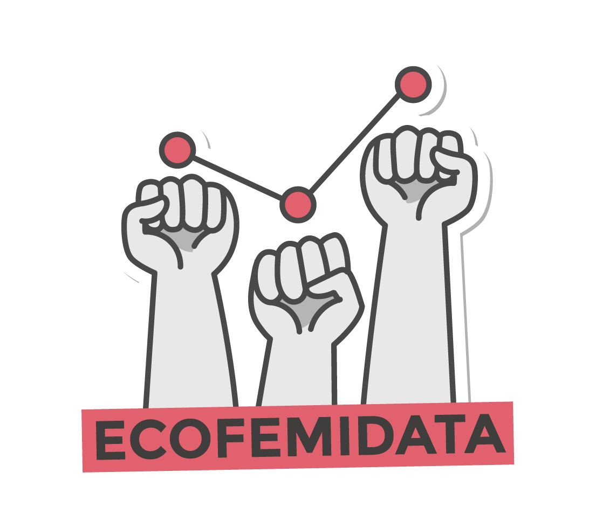

---
author:
categories:
date: "2023-07-03"
draft: false
excerpt: 
layout: single
links:
- icon: door-open
  icon_pack: fas
  name: website
  url: https://ecofeminita.com/app-ecofemidata/?v=3e8d115eb4b3
- icon: github
  icon_pack: fab
  name: code
  url: https://github.com/Ecofeminita/shinyapp
subtitle: A shinyapp
tags:
- R
title: ecofemidata shinyapp
---

---

### Explore gender inequalities

This app provides easy access to information on gender inequalities in the labor market, the distribution of unpaid labor, and income inequality. This interactive tool aims to raise awareness and favour data-driven discussions on these critical issues.

