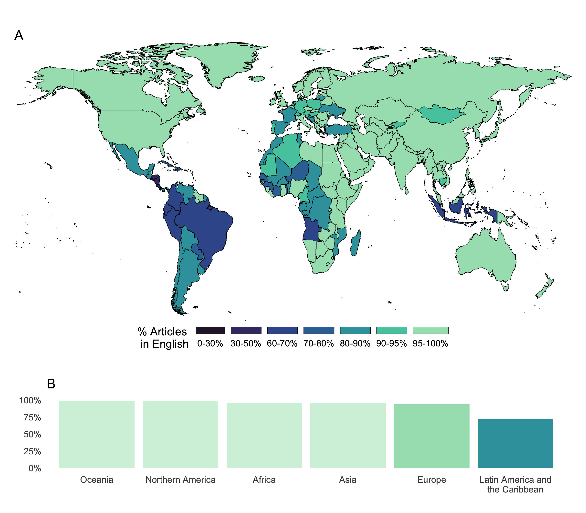

---
author:
categories:
date: "2023-07-03"
draft: false
excerpt: 
layout: single
links:
- icon: door-open
  icon_pack: fas
  name: website
  url: https://vlab.ebsi.umontreal.ca/languages_app/
- icon: github
  icon_pack: fab
  name: code
  url: https://github.com/caropradier/languages_science
subtitle: A shinyapp
tags:
- R
- shinyapps
title: languages in science
---

---

### Understand our research.

This app provides an interactive platform to explore the results of the article: [A smack of all neighbouring languages: How multilingual is scholarly communication?]( https://arxiv.org/abs/2504.21100)

