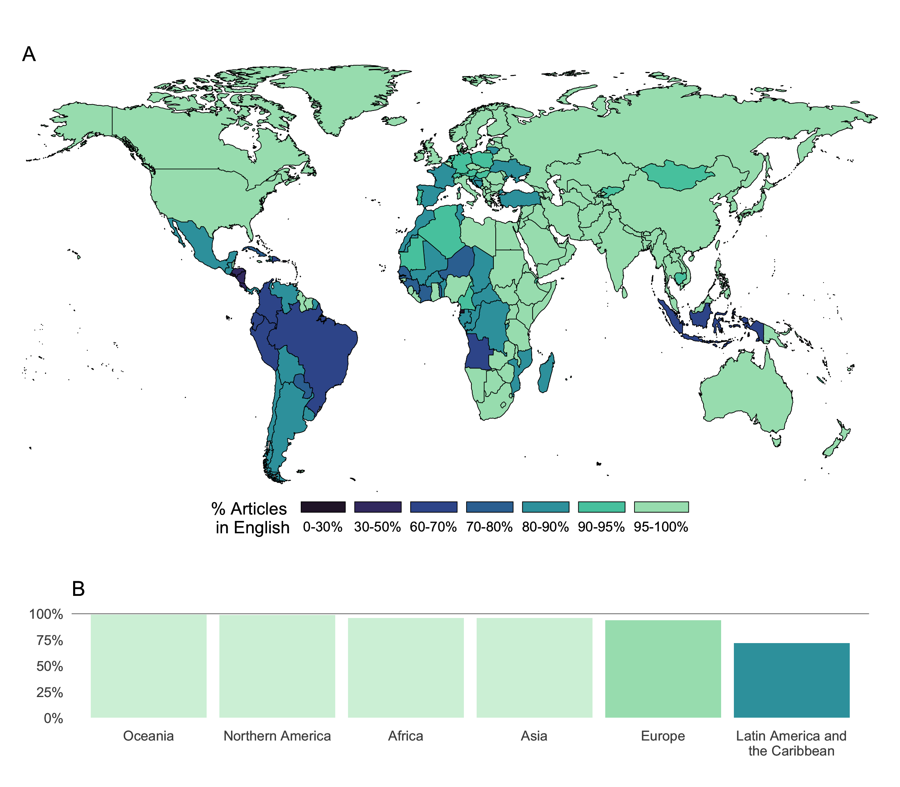

---
author:
categories:
date: "2023-07-03"
draft: false
excerpt: 
layout: single
links:
- icon: door-open
  icon_pack: fas
  name: website
  url: https://vlab.ebsi.umontreal.ca/languages_app/
- icon: github
  icon_pack: fab
  name: code
  url: https://github.com/caropradier/languages_science
subtitle: A shinyapp
tags:
- R
- shinyapps
title: languages in science
weight: 4
---

---

### Understand our research.

This app provides an interactive platform to explore the results of the article: [How multilingual is scholarly communication?
Mapping the global distribution of languages in publications and citations?](http://doi.org/10.1002/asi.70055).

<!--more-->

Language is a major source of systemic inequities in science, particularly among scholars whose first language is not English. Studies have examined scientists' linguistic practices in specific contexts; few, however, have provided a global analysis of multilingualism in science. Using two major bibliometric databases (OpenAlex and Dimensions), we provide a large-scale analysis of linguistic diversity in science, considering both the language of publications (N = 87,577,942) and of cited references (N = 1,480,570,087). For the 1990–2023 period, we find that only Indonesian, Portuguese, and Spanish have expanded at a faster pace than English. Country-level analyses show that this trend is due to the growing strength of the Latin American and Indonesian academic circuits. Our results also confirm the same-language preference phenomenon (particularly for languages other than English), the strong connection between multilingualism and bibliodiversity, and that social sciences and humanities are the least English-dominated fields. Our findings suggest that policies recognizing the value of both national-language and English-language publications have had a concrete impact on the distribution of languages in the global field of scholarly communication.

