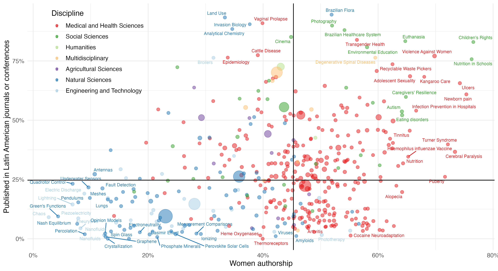

---
author:
categories:
date: "2023-07-03"
draft: false
excerpt: 
layout: single
links:
- icon: door-open
  icon_pack: fas
  name: website
  url: https://vlab.ebsi.umontreal.ca/latam_app/
- icon: github
  icon_pack: fab
  name: code
  url: https://github.com/caropradier/regional_circuits_gender_inequality
subtitle: A shinyapp
tags:
- R
- shinyapps
title: science for whom?
weight: 3
---

---

### Understand our research.

This app provides an interactive platform to explore the results of the article: [Science for whom? The influence of the regional academic circuit on gender inequalities in Latin America]( https://doi.org/10.1002/asi.24972).

<!--more-->

The Latin-American scientific community has achieved significant progress towards gender parity, with nearly equal representation of women and men scientists. Nevertheless, women continue to be underrepresented in scholarly communication. Throughout the 20th century, Latin America established its academic circuit, focusing on research topics of regional significance. Through an analysis of scientific publications, this article explores the relationship between gender inequalities in science and the integration of Latin-American researchers into the regional and global academic circuits between 1993 and 2022. We find that women are more likely to engage in the regional circuit, while men are more active within the global circuit. This trend is attributed to a thematic alignment between women's research interests and issues specific to Latin America. Furthermore, our results reveal that the mechanisms contributing to gender differences in symbolic capital accumulation vary between circuits. Women's work achieves equal or greater recognition compared to men's within the regional circuit, but generally garners less attention in the global circuit. Our findings suggest that policies aimed at strengthening the regional academic circuit would encourage scientists to address locally relevant topics while simultaneously fostering gender equality in science.

