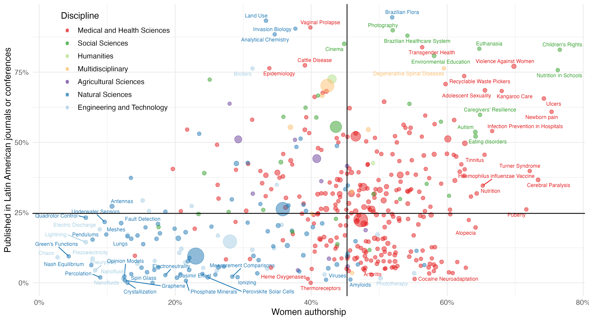

---
author:
categories:
date: "2023-07-03"
draft: false
excerpt: 
layout: single
links:
- icon: door-open
  icon_pack: fas
  name: website
  url: https://vlab.ebsi.umontreal.ca/latam_app/
- icon: github
  icon_pack: fab
  name: code
  url: https://github.com/caropradier/regional_circuits_gender_inequality
subtitle: A shinyapp
tags:
- R
- shinyapps
title: science for whom?
weight: 3
---

---

### Understand our research.

This app provides an interactive platform to explore the results of the article: [Science for whom? The influence of the regional academic circuit on gender inequalities in Latin America]( https://doi.org/10.1002/asi.24972).

