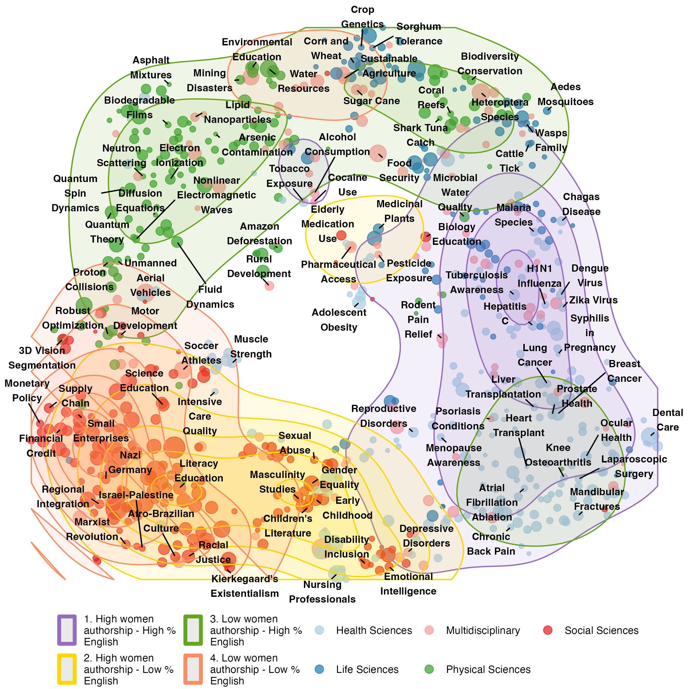

---
author:
categories:
date: "2023-07-03"
draft: false
excerpt: 
layout: single
links:
- icon: door-open
  icon_pack: fas
  name: website
  url: https://vlab.ebsi.umontreal.ca/lattes_app/
- icon: github
  icon_pack: fab
  name: code
  url: https://github.com/caropradier/lattes_sti
subtitle: A shinyapp
tags:
- R
- shinyapps
title: indexation inequalities
weight: 5
---

---

### Understand our research.

This app provides an interactive platform to explore the results of an [ongoing project](https://osf.io/preprints/socarxiv/msbnu_v1). 

Large-scale bibliometric databases generally provide a selective and geographically-biased representation of scientific production. Given that these indexing biases reduce the likelihood of retrieving certain types of scientific production, it has been historically hard to assess the extent and characteristics of those excluded scholarly communications. Based on the Lattes platform, a unique data source with comprehensive coverage of Brazilian scientific production, this paper assesses the coverage of two large-scale bibliometric databases: OpenAlex and Web of Science. Our findings identify the specific research areas underrepresented in both databases and assess the relation between publication language and indexing. Additionally, we examine gender-based differences in topic coverage, language, and indexation rates. Our results suggest that indexing biases disproportionately affect researchers focusing on locally relevant topics through articles written in Portuguese. Given women's overrepresentation in this group, our findings illustrate how indexing biases contribute to gender inequalities in science.

